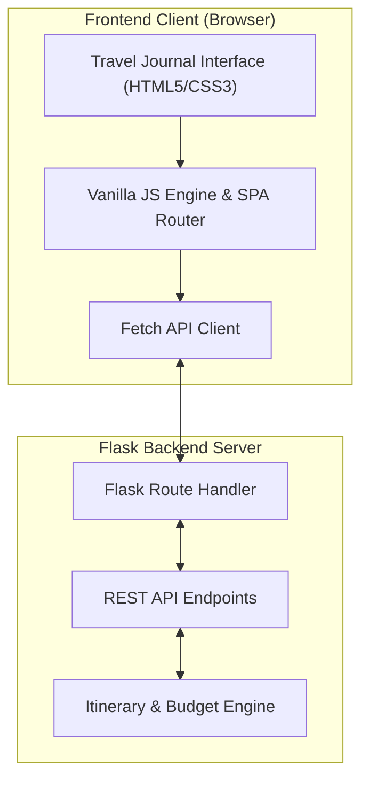

# TRIPWEAVE

> **Plan the Journey. Shape the Experience.**

TripWeave is a modern travel planning platform designed to convert travel ideas into structured day-wise itineraries, live budget breakdowns, packing checklists, saved places, and travel journals.

---

## Key Features

- **Curated Destination Discovery** — Explore handpicked destinations worldwide with recommended stay durations, estimated daily costs, and highlight style tags.
- **Journey Management** — Plan, organize, and manage travel itineraries with customizable travel styles, traveler counts, and status indicators (`Upcoming`, `In Progress`, `Completed`).
- **Interactive Itinerary Timeline** — Build day-by-day journey schedules with activity times, venues, categories, durations, costs, and advice notes.
- **Dynamic Budget Analytics** — Live calculated total expenses, daily average costs, per-person costs, and category breakdowns.
- **Smart Packing Checklist** — Categorized packing lists with real-time completion progress visualizer and single-click item management.
- **Travel Journal** — Capture daily reflections, notes, and memorable trip highlights.
- **35+ Saved Places & Photo Gallery** — Filterable photo gallery of attractions across culture, nature, landmarks, museums, beaches, adventure, heritage, and shopping.
- **Global Search** — Instant search across destinations, journeys, activities, and bookmarked places.
- **Print-Ready Itineraries** — CSS media print layout for generating clean paper prints or PDF exports.

---

## Design & Aesthetic

- **Palette**: Warm Cream (`#FAF8F5`), Deep Ocean Blue (`#154360`), Terracotta (`#C85A32`), and Muted Sage (`#4E6B5D`).
- **Typography**: Google Fonts pairing `'Playfair Display'`, `'Cinzel'`, `'Outfit'`, and `'Plus Jakarta Sans'`.
- **Interactions**: Slide-over quick action drawers, custom category pills, smooth section transitions, and toast alerts.

---

## Technology Stack

- **Frontend**: HTML5, CSS3 (Flexbox & CSS Grid), Vanilla JavaScript (ES6+), Fetch API
- **Backend**: Python 3, Flask RESTful Architecture
- **Testing**: Python `unittest` framework (36 Positive & Negative Test Cases)

---

## Architecture Diagram



---

## API Endpoints Overview

| Method | Endpoint | Description |
|---|---|---|
| `GET` | `/api/dashboard` | Returns dynamic dashboard metrics, active trips, and primary summary |
| `GET` / `POST` | `/api/destinations` | List filtered destinations or add a custom destination |
| `GET` / `POST` | `/api/trips` | List user journeys or create a new trip |
| `GET` / `PATCH` / `DELETE` | `/api/trips/<id>` | View trip itinerary, update trip status, or delete trip |
| `GET` / `POST` | `/api/trips/<id>/activities` | Get or create day-wise itinerary activities |
| `PATCH` / `DELETE` | `/api/activities/<id>` | Update activity details or delete an activity |
| `GET` / `POST` | `/api/places` | Get saved attractions or add a new place |
| `GET` / `POST` | `/api/trips/<id>/packing` | Retrieve or add items to trip packing list |
| `PATCH` / `DELETE` | `/api/packing/<id>` | Update item completion status or remove packing item |
| `GET` / `POST` | `/api/trips/<id>/journal` | Retrieve or create travel journal entries |
| `GET` | `/api/search?q=<query>` | Global search across destinations, trips, places, and activities |

---

## Quick Start

### 1. Requirements & Setup
Navigate to the project root directory:
```bash
cd C:\Users\rosha\tripweave
```

Install dependencies:
```bash
pip install -r requirements.txt
```

### 2. Run Server
Start the Flask development server:
```bash
python app.py
```
Open `http://127.0.0.1:5000` in your web browser.

---

## Automated Testing

Run the full True & False (Positive & Negative) test suite:
```bash
python test_suite.py
```
